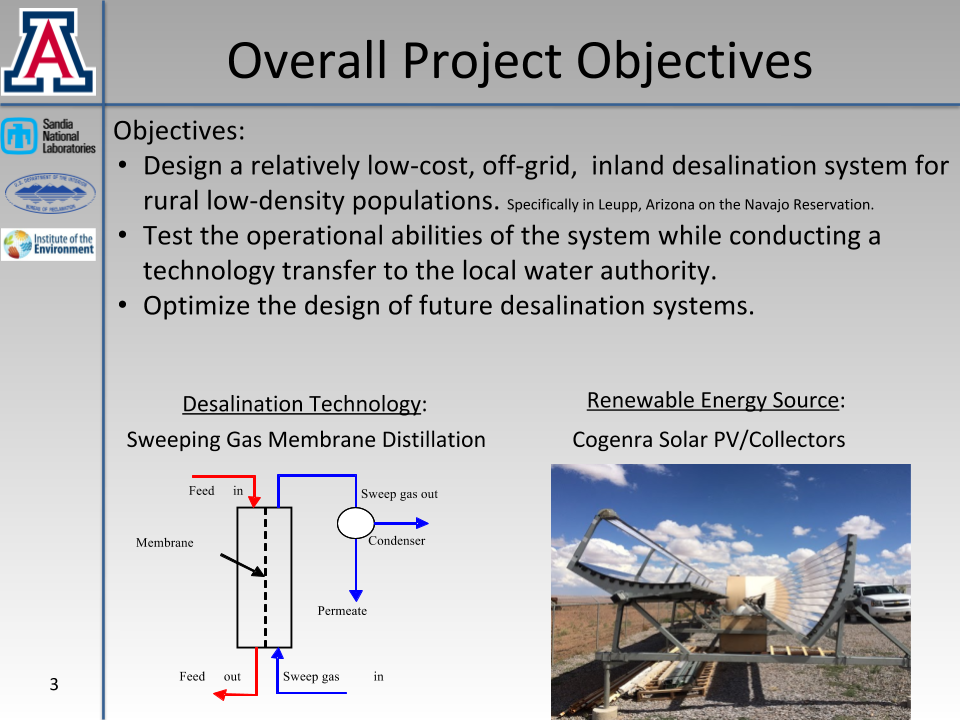
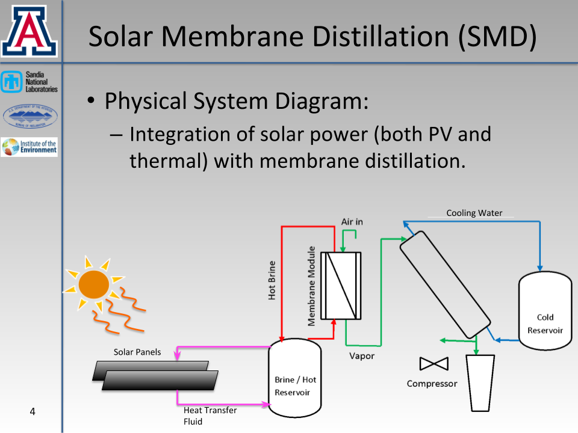
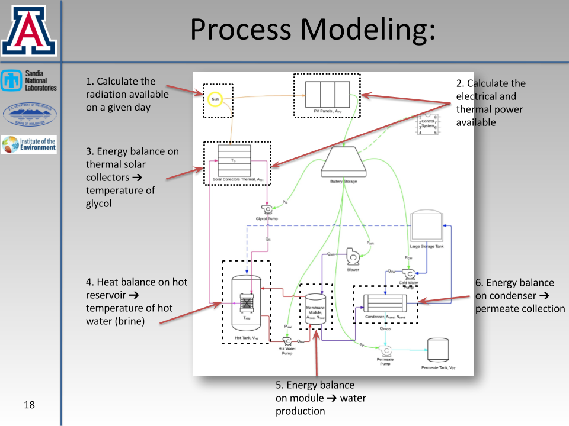
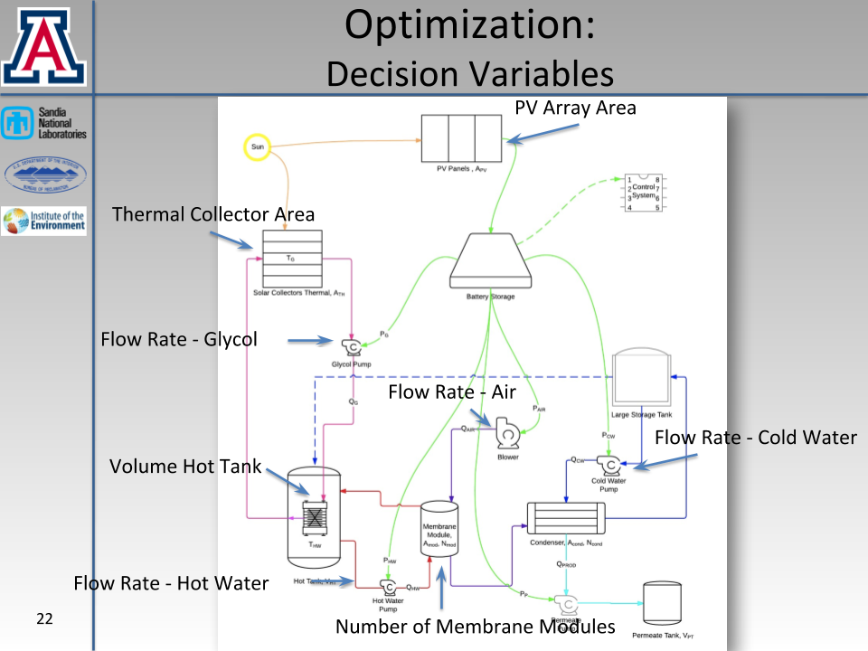
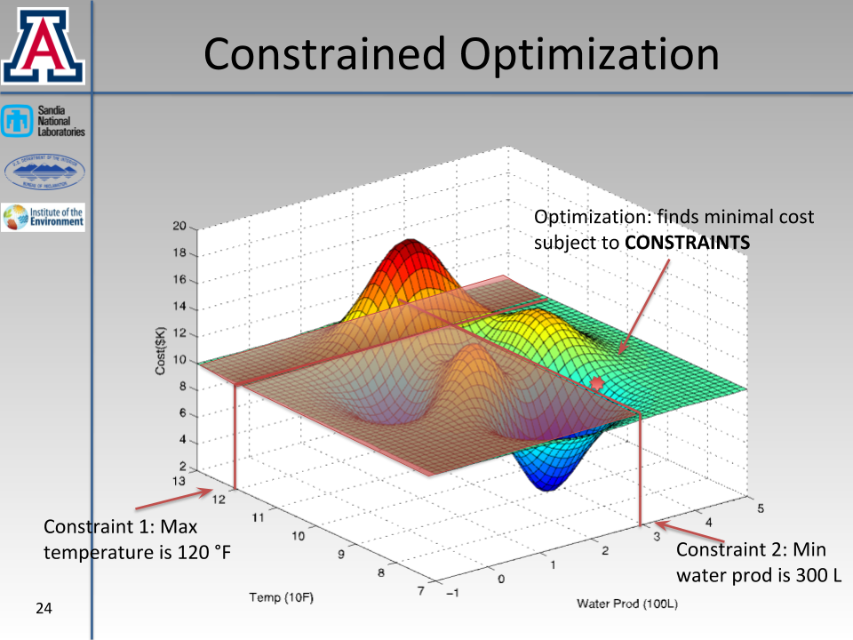
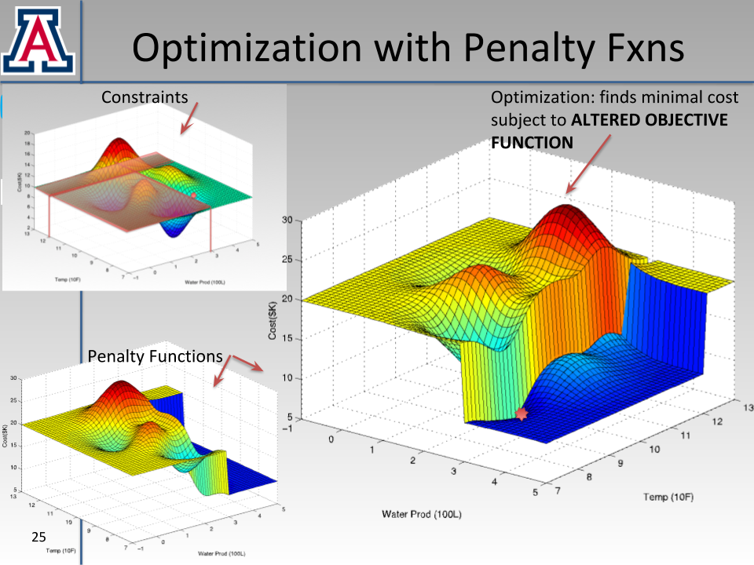
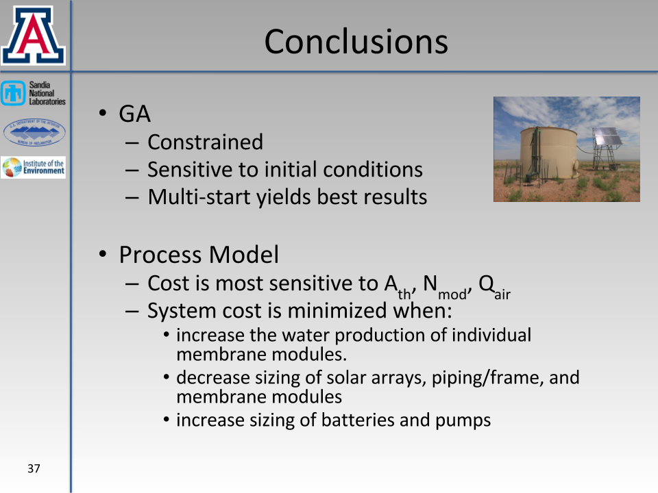

# solar-desalination

  The performance simulation of solar membrane distillation (SMD) systems is necessary to determine their economic and technological feasibility for use as an autonomous off-grid desalination method that would allow communities in arid or underdeveloped areas to implement and maintain saline water treatment systems. The theoretical and empirical SMD process model created to simulate these systems predicts system performance by mathematically merging multiple physical system components with unsteady environmental processes to predict energy flows, water production, and capital costs. The process model in conjunction with a genetic algorithm, used as an external optimizer, finds the optimal system capacity based on the minimization of the unit cost of water produced subject to production and performance requirements and temperature constraints.

  The process model is most sensitive to the following decision variables: number of membrane modules, area of the solar thermal collectors, and flow rate of the air. Optimal solutions contain membrane modules with greater individual water production rates, which are caused by a combination of high hot water temperatures and large air and hot water flow rates. Low cost of water produced is caused by a simultaneous combination of high water production and low capital costs, as opposed to high water production in expensive systems or low water production in inexpensive systems. SMD systems become more cost effective as they increase in size; a 10 LPD system produces a $0.15/L over a 10 year lifetime whereas 100 LPD system produces a $0.03/L. Generally, the economy is scale is seen in systems that produce 80 LPD or more. Additionally, as the size of a SMD system increases, ratio of thermal solar collector area to photovoltaic area decreases. Generally, the optimizer finds the optimal SMD capacity by incrementally decreasing heat wastage as excess equipment is subtracted from the system.

  FULL PUBLICATION SUBMITTED AUGUST 2017.
  Please contact me for inquiries related to updated code.
  Abstract above is from Master's report, *not publication*.

## Brief Overview of Project
(snippets of May 2015 defense presentation on project)

### Overall Project Objectives

### Physical System Design

### Overview of Process Modeling

### Decision Variables for Optimization

### Optimization with Constraints

### Optimization with Penalty Functions

### Conclusions

